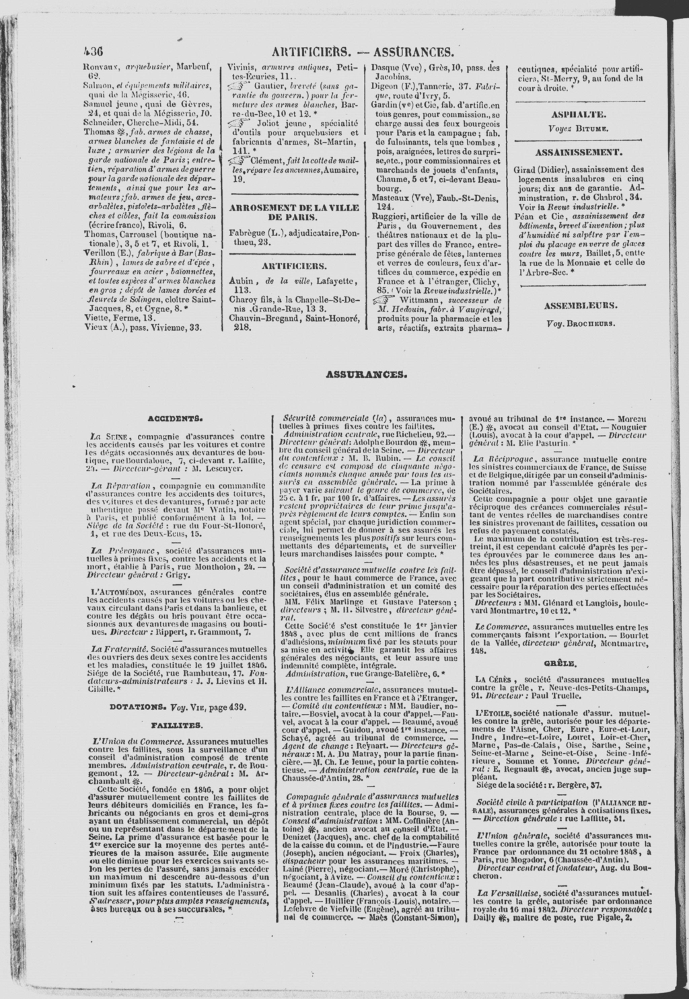
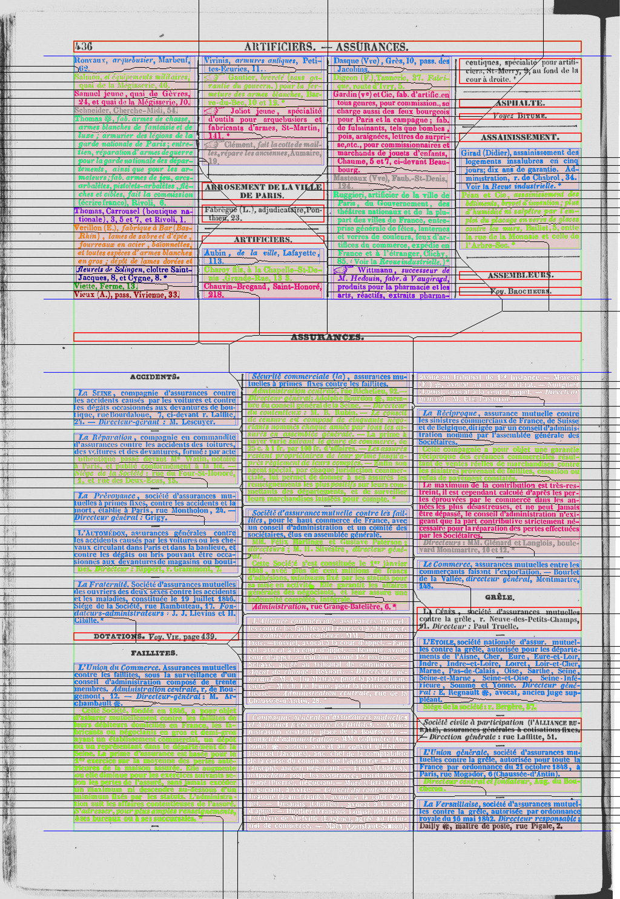

# API

See the related documentation in the [API](./doc/api.md) page.

# Running the server

## Running the server with docker
See the related documentation to [run using docker](./docker/README.md).


## Running the server from sources

The simplest way to get started is to:
1. Build the C++ code as explained in the [build instructions](./build.md)
2. Copy `build/back/c++-bindings/soducocxx.cpython-38-x86_64-linux-gnu.so` in
   `back/soducocxx.cpython-38-x86_64-linux-gnu.so`
3. Create a [settings config file](./docker/settings.cfg) and export its path:
   `export SODUCO_SETTINGS="<PATH_TO_SETTINGS.CFG>"`
4. Run the server with ``python -m flask run``

## Fast build and test using Docker for development
1. Make sure your configuration for the frontend is correct: update the port in `~/.config/soduco_annot/general_config.ini` so that `port=8000`
2. Configure `docker/.env` to allow direct connection to the server (create if needed from any `docker/.env-sample*` files):
   * update `PATH_DIRECTORIES` to you local path
   * set `REVERSE_PORT=8000`
   * remove any line with `SCRIPT_NAME`
3. Use the [following dockerfile](https://gitlab.lrde.epita.fr/soduco/docker-base-images/-/blob/master/soduco-back-cppbuilder/Dockerfile) to build the core library:
   * download this file to an empty directory
   * build the docker image for the builder with `docker build -t soduco/back_builder -f docker/soduco-back-cppbuilder.dockerfile .`
   * you can now run the builder in the root of the backend project: `docker run --rm -it -v $(pwd):/app/ soduco/back_builder sh build.sh`
   * the artifacts are now at the right place for the deployment image to be built
4. Download (and check for newer) assets
   * `sftp soducoshared@geohistoricaldata.org:./public/fr_ner_directories-20210720.tar.gz`
   * `wget https://www.lrde.epita.fr/~jchazalo/SHARE/pero_eu_cz_print_newspapers_2020-10-09.tar.gz`
   * `wget https://download.pytorch.org/models/vgg16-397923af.pth`
5. Build and launch the deployment image using docker-compose (use [pipx](https://pypi.org/project/pipx/) to install it if needed):
   * `cd docker`
   * `docker-compose up --build`
   * the server should run and listen to `*:8000`


# Building from sources

To build the project from C++ sources, see the related [documentation](./build.md)

# Python Commandline interface

The command line interface is described [here](doc/cli.md)


# DOM & JSON Format description (outdated)

## Document Model

```
Page      := ( Section_1 | Title_1 )*
Section_1 := ( Column_1 )*
Column_1  := ( Section_2 )*
Section_2 := ( Column_2 )*
Column_2  := ( Entry )*
Entry     := ( Line )*

Terminaux:
Title_1   := 
Title_2   := 
Line      := 
```

## JSON Schema

* Non-terminal nodes map to JSON Element objects

  ```js
  {
    "type" : STRING // One of ( "PAGE" | "SECTION" | "COLUMN" | "ENTRY" | "LINE" | "TITLE" )   
    "bbox" : ARRAY OF INT // Element Bounding box coordinates [x, y, width, height]
    "children" : ARRAY OF OBJECTS // List of Children Elements   
  }

note that bounding box coordinates are for the **deskewed** image

* Text nodes (TITLE and LINE) have also the ``"text" : STRING`` attribute.


## Example


Input                    |          Output           | JSON
------------------------ | ------------------------- | ---
 |  | [JSON file](./doc/output-439.json)


## Deploy to LRDE's public server

Connect to `docker.lrde.epita.fr`

```shell
cd /etc/docker/compose/directory-annotator

# logs
docker-compose -p directory-annotator logs backend

# Up
systemctl start docker-compose@directory-annotator.service

# Stop
docker-compose -p directory-annotator stop
```
